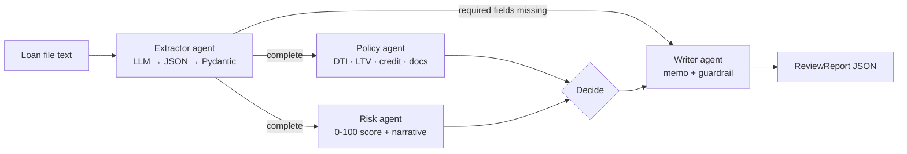

# Loan Review Agents

[](https://github.com/gopipamulapati/loan-review-agents/actions/workflows/ci.yml)


A **multi-agent mortgage loan pre-review system** built with **LangGraph**. It reads a
free-text loan file and does four things:

1. Extracts structured data from the file.
2. Runs policy checks and a risk assessment **in parallel**.
3. Makes a recommendation: approve, refer to an underwriter, decline, or ask for more information.
4. Writes a review memo for a human underwriter.

It's served through **FastAPI**, packaged with **Docker**, and tested in **GitHub Actions**.
It runs fully offline by default, and the model is switched to **OpenAI** or **AWS Bedrock**
with one environment variable.

> All loan data in this repo is synthetic, and the thresholds in `config.py` are simplified
> examples for demonstration. They are not real lending guidelines.

---

## Why it's built this way

Using LLMs in regulated domains like lending means splitting the work carefully between the
model and deterministic code:

| Concern | Who handles it | Why |
|---|---|---|
| Reading messy documents | **LLM** (JSON output checked against a Pydantic schema) | Unstructured input is where LLMs help most |
| Pass/fail policy rules | **Deterministic Python** | Must be auditable and reproducible |
| Risk score | **Transparent weighted formula** | Explainable; the LLM can't change it |
| Narrative and memo | **LLM**, with a guardrail | Readable output, but the decision can't be altered |
| Final decision | **Human underwriter** | The system only recommends |

Guardrails built in:

- **Schema validation with fallback.** If the LLM returns malformed or out-of-range JSON
  (for example, a credit score of 9999), the extractor falls back to a regex parser instead
  of crashing.
- **Decision lock.** If the LLM's rewrite of the memo drops or changes the recommendation,
  the rewrite is rejected and the template memo is used.
- **Short-circuit on missing data.** Incomplete files skip scoring and go straight to a
  "needs more info" memo, so the system never scores a loan it doesn't have the numbers for.
- **Per-node tracing.** Every report shows which agents ran and how long each one took.

## Architecture



The policy and risk agents run as parallel LangGraph branches. The `decide` node waits for
both. Trace entries from the parallel branches are merged with an `operator.add` state
reducer.

## Quick start

```bash
git clone https://github.com/gopipamulapati/loan-review-agents.git
cd loan-review-agents
python -m venv .venv && source .venv/bin/activate
pip install -e ".[dev]"

loan-review samples/*.txt          # review the four sample files
pytest -q                          # 26 tests, no API key needed
```

Example output:

```
=== 02_borderline_applicant.txt -> refer_to_underwriter ===

## Loan review: Marcus Webb

**Recommendation:** REFER TO UNDERWRITER
**Risk:** 62/100 (high)

### Issues
- **WARNING** (credit_score): Credit score 688 is below the preferred 740.
- **WARNING** (dti): DTI 42.1% is above the comfort level 36%.
- **WARNING** (ltv): LTV 90.0% is above 80%; mortgage insurance expected.
- **WARNING** (employment): Only 1.5 years at current employer (prefer 2+).
- **WARNING** (documents): Missing documents: bank_statement.

trace: extract -> policy -> risk -> decide -> write
```

| Sample | Outcome |
|---|---|
| `01_strong_applicant.txt` | approve (risk 11/100) |
| `02_borderline_applicant.txt` | refer to underwriter (risk 62/100) |
| `03_high_risk_applicant.txt` | decline (credit, DTI and LTV fail) |
| `04_incomplete_file.txt` | needs more info (skips scoring) |

## Use a real LLM

```bash
cp .env.example .env

# OpenAI
pip install -e ".[openai]"
export LLM_PROVIDER=openai OPENAI_API_KEY=sk-...

# or AWS Bedrock (Claude via the Converse API)
pip install -e ".[bedrock]"
export LLM_PROVIDER=bedrock AWS_REGION=us-east-1

loan-review samples/02_borderline_applicant.txt
```

To add another provider, write a class with a `complete(system, user) -> str` method in
`src/loan_review/llm.py`.

## REST API

```bash
uvicorn loan_review.api:app --reload
# or
docker build -t loan-review-agents . && docker run -p 8000:8000 loan-review-agents
```

```bash
curl -X POST localhost:8000/review \
  -H "content-type: application/json" \
  -d "{\"text\": $(jq -Rs . < samples/01_strong_applicant.txt)}"
```

Interactive docs are at `http://localhost:8000/docs`.

## Project layout

```
src/loan_review/
├── graph.py          # LangGraph StateGraph: routing, parallel branches, tracing
├── agents/
│   ├── extractor.py  # LLM JSON extraction with Pydantic validation + regex fallback
│   ├── policy.py     # deterministic DTI / LTV / credit / document checks
│   ├── risk.py       # weighted risk score + LLM narrative
│   └── writer.py     # memo generation with a decision-lock guardrail
├── llm.py            # Offline / OpenAI / Bedrock providers behind one interface
├── models.py         # Pydantic models (LoanApplication, Finding, ReviewReport)
├── config.py         # policy thresholds
├── api.py            # FastAPI service
└── cli.py            # `loan-review` command
tests/                # unit, graph, guardrail and API tests (scripted LLM, no network)
```

## Testing approach

The tests use a `ScriptedLLM` that returns canned replies. This lets the suite exercise
the real LLM code paths without network calls, including:

- valid JSON extraction
- schema-violating JSON that falls back to regex
- a memo rewrite that tries to flip a DECLINE to APPROVE, which the guardrail blocks

CI runs ruff and pytest on Python 3.10, 3.11 and 3.12, then builds the Docker image.

## Roadmap

- [ ] PDF ingestion (pay stubs, W-2s) with OCR
- [ ] Human-in-the-loop interrupt for `refer_to_underwriter` using LangGraph checkpoints
- [ ] LangSmith / OpenTelemetry tracing
- [ ] Evaluation set comparing LLM extraction accuracy across models
- [ ] Terraform deployment to AWS (ECS Fargate + Bedrock)

## License

MIT © Gopi Pamulapati
